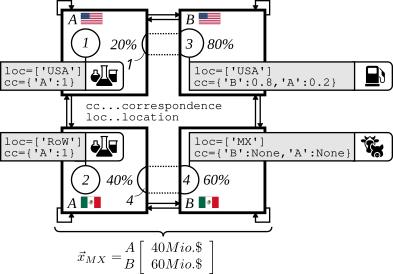

# Hybrid Life-Cycle Assessment

## Concordance (=Matching of Processes and Sectors)

{ align=center }

Some text here 

$$
a = \begin{bmatrix}
    1 & 0 & 0 \\
    0 & 1 & 0 \\
    0 & 0 & 1
\end{bmatrix}
$$
